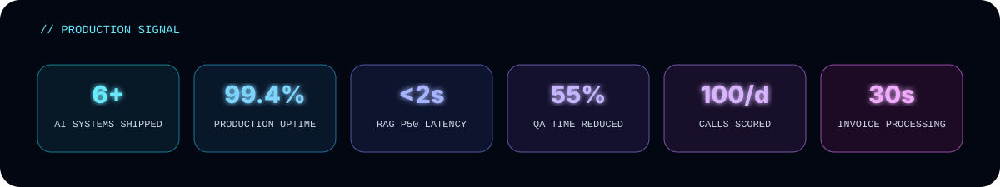
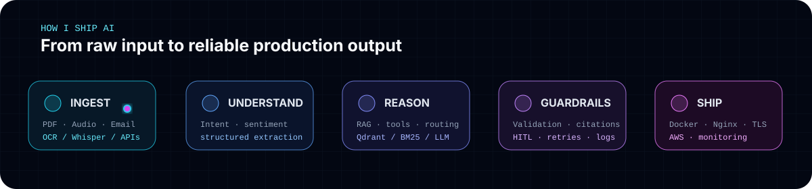
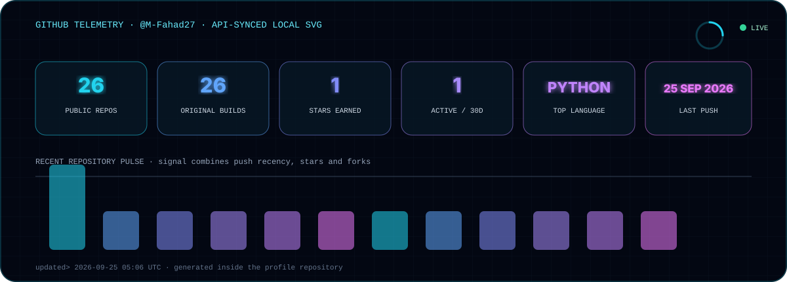

---

## `01 SYSTEM.IDENTITY`

  
  

I work in the **messy middle between a successful AI demo and a dependable production system**. My focus is not only model output—it is retrieval quality, latency, failure recovery, structured responses, observability, deployment, and the human checkpoints that make AI safe enough to operate real workflows.

  

---

## `02 FEATURED.SYSTEMS`

<table>
<tr>
<td width="50%" valign="top">

### ⚡ [InvoiceFlow AI](https://demo.fahadai.site)
**Intelligent invoice processing · Live**

Monitors inboxes, routes PDF/image invoices through OCR and LLaMA extraction, validates approval thresholds, pauses for human decisions, resumes through webhooks, and logs structured audit data.

`n8n` `Groq` `LLaMA 3.3` `OCR` `Gmail API` `Google Sheets` `Docker` `AWS`

**Signal:** `~15 min → <30 sec per invoice`

</td>
<td width="50%" valign="top">

### 🧠 [SupportIQ](https://aisupport.fahadai.site)
**AI customer-support agent · Live**

Combines intent and sentiment routing, Qdrant retrieval, Ollama embeddings, order lookup, automatic ticketing, escalation logic, and concise human-agent handoff summaries.

`Groq` `Qdrant` `Ollama` `RAG` `Streamlit` `Docker` `Nginx` `AWS EC2`

**Signal:** `8-stage AI pipeline · 3 Docker services`

</td>
</tr>
<tr>
<td width="50%" valign="top">

### 📚 [DocuMind](https://www.fahadai.site)
**Source-grounded document intelligence · Production**

A production RAG system with dense + BM25 hybrid retrieval, Cohere reranking, citation grounding, per-tenant isolation, and hot-swappable embedding models over a 10K+ document corpus.

`Flowise` `Qdrant` `Ollama` `Groq` `Docker`

**Signal:** `99.4% uptime · <2s p50 latency`

</td>
<td width="50%" valign="top">

### 🎧 [Speak-Align](https://www.fahadai.site)
**Call-center QA automation · Production**

Processes call recordings, separates speakers, transcribes dialogue, checks script compliance and order violations, produces timestamped flags, and delivers an operations digest.

`Whisper` `pyannote` `LangChain` `FastAPI` `Postgres` `n8n`

**Signal:** `100 calls/day · 55% less manual QA time`

</td>
</tr>
<tr>
<td width="50%" valign="top">

### 🗓️ [AI Meeting Assistant](https://www.fahadai.site)
**Recording → decisions → tasks · Production**

Detects recordings, transcribes meetings, extracts summaries, decisions and action items, emails recaps, and creates prioritized ClickUp tasks with no manual handoff.

`n8n` `Groq Whisper` `Cloudinary` `Gmail API` `ClickUp API`

**Signal:** `3-minute turnaround · 100% auto-delivery`

</td>
<td width="50%" valign="top">

### 🎙️ [AI Interview Analyzer](https://github.com/M-Fahad27?tab=repositories)
**Speech-aware interview analysis · Open source**

Records candidate speech, transcribes responses, evaluates sentiment and confidence, and exports structured JSON feedback across multiple evaluation axes.

`Python` `Streamlit` `Gemini API` `Transformers`

**Signal:** `structured scoring · JSON report export`

</td>
</tr>
</table>

  

---

## `03 ACTIVE.TOOLCHAIN`

### AI, retrieval and agents

### Runtime, automation and cloud

---

## `04 EXPERIENCE.LOG`

  

<b>Verified learning signal</b>

 

- AWS Solutions Architect
- AWS Cloud Practitioner
- Certified AI Engineer Associate

---

## `05 GITHUB.TELEMETRY`

  

### Contribution stream

<picture>
  <source media="(prefers-color-scheme: dark)" srcset="./assets/github-contribution-grid-snake-dark.svg" />
  <source media="(prefers-color-scheme: light)" srcset="./assets/github-contribution-grid-snake.svg" />
  
</picture>

---

## `06 COLLABORATION.PROTOCOL`

I am most useful on problems where AI must do **real operational work**:

- production RAG with hybrid retrieval, reranking, grounding and tenant isolation
- tool-using agents with routing, memory, retries and human approval checkpoints
- speech intelligence with transcription, diarization, scoring and structured reporting
- AI workflow automation connecting email, documents, APIs, queues and business systems
- deployment of containerized AI services on Linux/AWS with Nginx, TLS and observability

### Have a real AI problem—not just a chatbot idea?

 

Designed as a production-minded profile: identity → proof → systems → stack → telemetry → contact.

